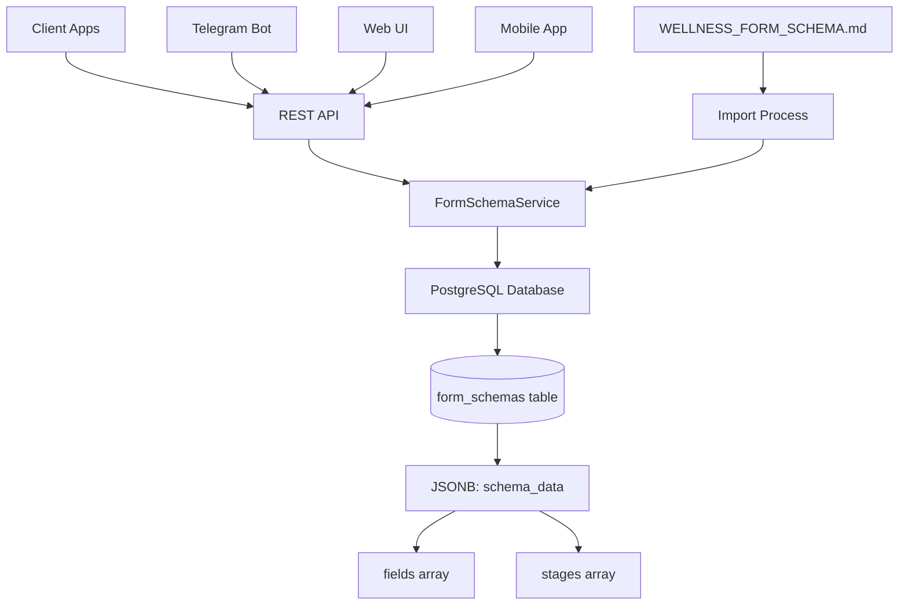
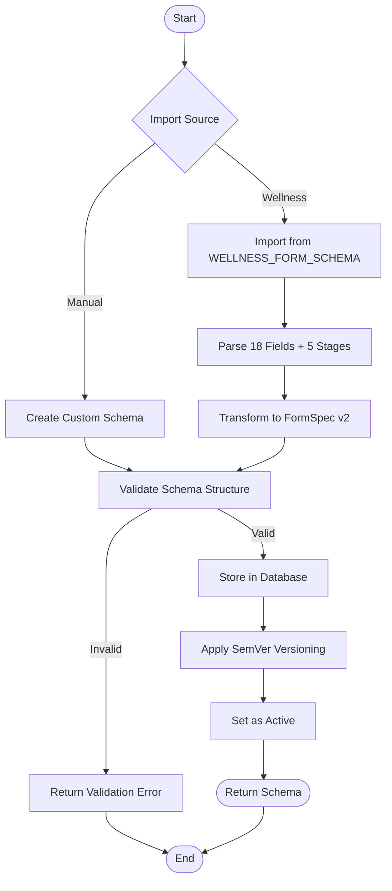
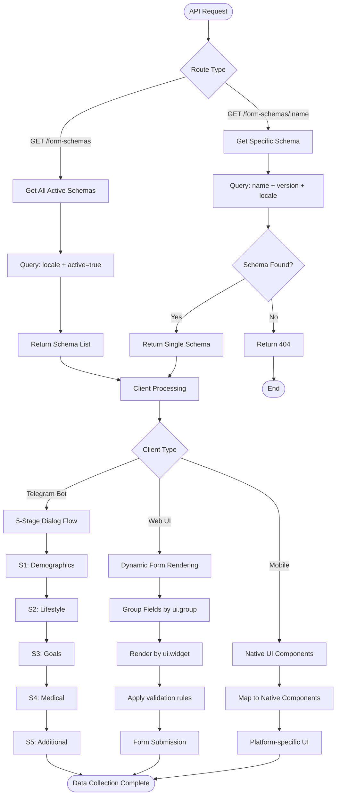
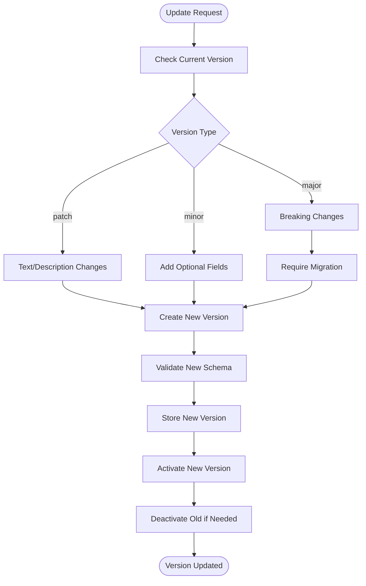

# FormSpec v2 - System Workflow & Algorithm

## 🔄 System Architecture Overview



## 📋 Core Algorithm Flow

### 1. Schema Creation & Import



### 2. Schema Retrieval & Usage



### 3. Versioning & Updates



## 🎯 What You Can Do With FormSpec v2

### For Telegram Bot Developers

1. **Dynamic Dialog Creation**
   ```typescript
   // Get schema
   const schema = await fetch('/api/form-schemas/wellness_intake');
   
   // Process stages
   for (const stage of schema.stages) {
     await collectStageData(stage.targets, stage.name);
   }
   ```

2. **Field-Specific Prompts**
   ```typescript
   function generatePrompt(field: FieldSpec) {
     return `${field.ui.label}: ${field.ui.placeholder}
     ${field.enum ? `Options: ${field.enum.join(', ')}` : ''}
     ${field.required ? '(Required)' : '(Optional)'}`;
   }
   ```

### For Web/Mobile UI Developers

1. **Dynamic Form Generation**
   ```typescript
   // Group fields for better UX
   const groups = schema.fields.reduce((acc, field) => {
     const group = field.ui?.group || 'default';
     acc[group] = acc[group] || [];
     acc[group].push(field);
     return acc;
   }, {});
   
   // Render by group
   Object.entries(groups).map(([group, fields]) => 
     renderFieldGroup(group, fields)
   );
   ```

2. **Widget Mapping**
   ```typescript
   function renderField(field: FieldSpec) {
     switch (field.ui?.widget) {
       case 'number': return <NumberInput field={field} />;
       case 'select': return <Select options={field.enum} />;
       case 'tags': return <TagInput maxItems={field.validation?.maxItems} />;
       case 'textarea': return <TextArea field={field} />;
       default: return <TextInput field={field} />;
     }
   }
   ```

### For Backend Integration

1. **Schema Validation**
   ```typescript
   // Validate collected data against schema
   function validateData(data: any, schema: FormSpec): ValidationResult {
     return schema.fields.map(field => {
       const value = data[field.key];
       return validateField(value, field);
     });
   }
   ```

2. **Multi-language Support**
   ```typescript
   // Get localized schema
   const ruSchema = await fetch('/api/form-schemas/wellness_intake?locale=ru-RU');
   const enSchema = await fetch('/api/form-schemas/wellness_intake?locale=en-US');
   ```

## 🔧 Advanced Use Cases

### 1. A/B Testing Different Forms
```typescript
// Deploy different schema versions
await createSchema({...baseSchema, version: '1.1.0', fields: enhancedFields});
await createSchema({...baseSchema, version: '1.2.0', fields: alternativeFields});

// Route users to different versions
const version = isTestGroup ? '1.1.0' : '1.2.0';
const schema = await getSchema('wellness_intake', version);
```

### 2. Progressive Form Enhancement
```typescript
// Start with minimal fields
const basicSchema = await getSchema('wellness_intake', '1.0.0');

// Upgrade to detailed collection
const detailedSchema = await getSchema('wellness_intake', '2.0.0');

// Migrate existing data
const migrated = migrateData(userData, basicSchema, detailedSchema);
```

### 3. Custom Form Creation
```typescript
// Create organization-specific forms
const customSchema: FormSpec = {
  name: 'company_wellness',
  version: '1.0.0',
  fields: [...standardFields, ...companySpecificFields],
  stages: customStages
};

await formSchemaService.createSchema(customSchema);
```

### 4. Conditional Field Display
```typescript
// Use field priorities and groups for progressive disclosure
const highPriorityFields = schema.fields
  .filter(f => f.ui?.priority <= 5)
  .sort((a, b) => (a.ui?.priority || 0) - (b.ui?.priority || 0));

// Show advanced fields conditionally
const advancedFields = schema.fields.filter(f => f.ui?.priority > 10);
```

## 📊 Data Flow Summary

1. **Schema Definition** → Store in PostgreSQL with versioning
2. **Client Request** → Fetch schema via REST API
3. **UI Generation** → Render forms/dialogs based on metadata
4. **Data Collection** → Follow stage progression and validation rules
5. **Data Submission** → Validate against schema constraints
6. **Storage** → Store collected data with schema reference

## 🎪 Key Benefits

✅ **Single Source of Truth** - All form definitions centralized  
✅ **Version Control** - SemVer-based schema evolution  
✅ **Multi-Platform** - Same schema works for bot, web, mobile  
✅ **Localization Ready** - Multi-language support built-in  
✅ **Type Safe** - Full TypeScript definitions  
✅ **Flexible UI** - Metadata-driven rendering  
✅ **Validation** - Centralized rules enforcement  
✅ **Extensible** - Easy to add new field types and widgets  

This system provides a robust foundation for dynamic form management across all your applications!
